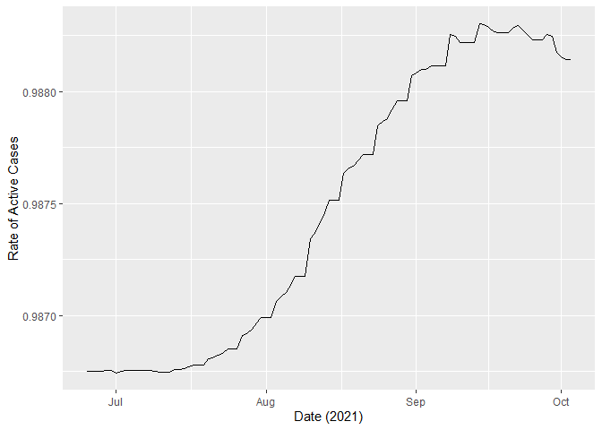
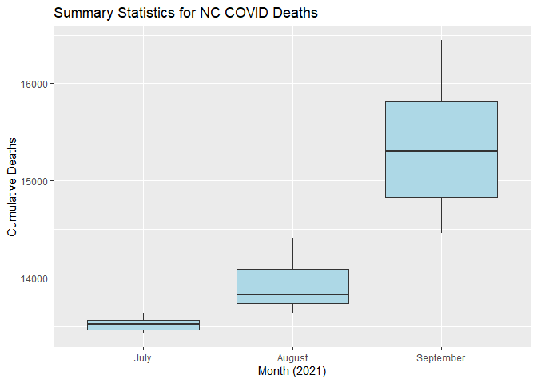
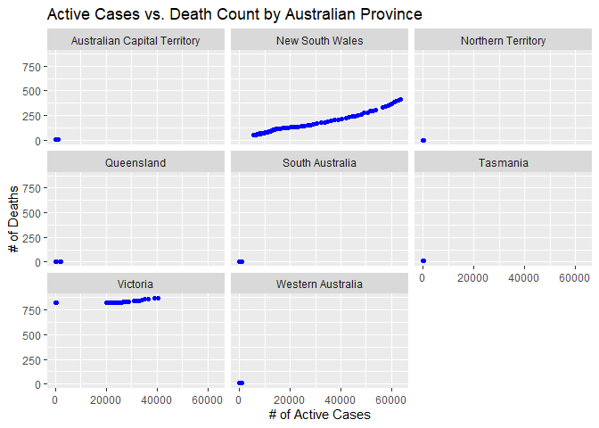
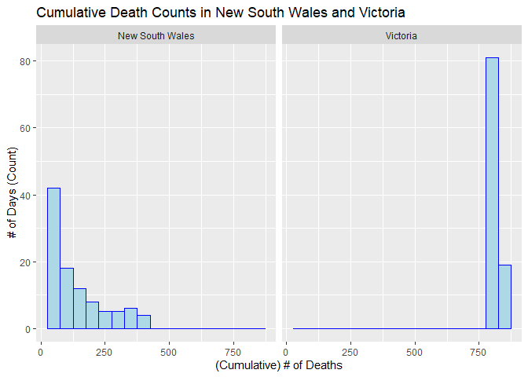
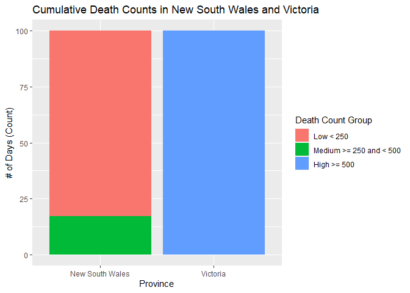

ST 558 Project 1: Interacting with the COVID API
================
Rebecca Voelker
10/05/2021

This document will walk the reader through the process of connecting to
& collecting data from the COVID API within R.

## **Render Code (for Reference ONLY)**

``` r
rmarkdown::render("ST_558_Project_1.Rmd", "github_document","README.md")
```

## **Packages Required for Vignette**

The below packages are required for connecting to the API, as well as
the subsequent data analysis and exploration performed on the data
retrieved from the API.

1.  `httr` - *Retrieves Data from an API*
2.  `jsonlite` - *Parses Results from an API Query*
3.  `dplyr` - *A part of the `tidyverse` universe of packages,
    specifically used for manipulating data*
4.  `tidyr` - *A part of the `tidyverse` universe of packages,
    specifically used for data cleaning and ‘tidying’*
5.  `ggplot2` - *A part of the `tidyverse` universe of packages,
    specifically used for creating graphics*

``` r
# Read in Required Packages 
library(httr)
library(jsonlite)
library(dplyr)
library(tidyr)
library(ggplot2)
```

## **COVID API Function Calls**

Below are 6 functions, I have created to call various endpoints of the
[COVID-19 API
Data](https://documenter.getpostman.com/view/10808728/SzS8rjbc#e831c268-9da1-4d86-8b5a-8d7f61910af8).

Note that for each function created, I have performed a test of the
function call, outputting the object as *functionname*\_Test.

### `CountryFun`

This function call, calls in a user-specified country and it’s
slug-code. This provides a helpful reference for country names that can
be used in subsequent function calls.

``` r
# This function will call in a user-specified country and it's slug code
CountryFun <- function(country){
  base <- "https://api.covid19api.com/live/country/"
  endpoint <- country
  paste <- paste(base, endpoint, sep = "")
  outputAPI <- fromJSON(paste)
  return(as_tibble(outputAPI))
}

CountryFun_Test <- CountryFun("australia")
```

### `CountryCOVIDFun`

This function call, calls in the details of COVID cases in a
user-specified country. Details include the Total Number of Confirmed
COVID Cases, the Total Number of Recoveries, and the Total Number of
Deaths.

``` r
# This function will call in the details of COVID cases in a user-specified country
CountryCOVIDFun <- function(country){
  API_init <- GET("https://api.covid19api.com/summary")
  API_content <- content(API_init, as = "text")
  API_JSON <- fromJSON(API_content)
  output <- API_JSON$Countries %>% select(ID:TotalRecovered) %>% filter(Country == country)
}

CountryCOVIDFun_Test <- CountryCOVIDFun("South Africa")
```

### `CountryConfirmFun`

This function call, calls in the details of COVID cases in a
user-specified country (x), *by province/state*. Details include the
Total Number of Confirmed COVID Cases, the Total Number of Recoveries,
and the Total Number of Deaths. User can also specify if they would like
to look at the data, as-of a specific \# of Confirmed Cases (y).

``` r
# This function will call in the details of COVID cases in a user-specified country, as of y (user-specified #) confirmed cases
CountryConfirmFun <- function(x, y){
  base <- "https://api.covid19api.com/live/country/"
  endpoint <- x
  paste_url <- paste(base, endpoint, sep = "")
  API_init <- GET(paste_url)
  API_content <- content(API_init, as = "text")
  API_JSON <- fromJSON(API_content)
  output <- API_JSON %>% filter(Confirmed >= y)
  return(output)
}

CountryConfirmFun_Test <- CountryConfirmFun("australia", 5000)
```

### `USCOVIDFun`

This function call, calls the details of COVID cases in a particular
state in the United States. Details include the Total Number of
Confirmed COVID Cases, the Total Number of Recoveries, and the Total
Number of Deaths.

``` r
# This function will call in the details of COVID cases in a user-specified state in the United States
USCOVIDFun <- function(province){
  API_init <- GET("https://api.covid19api.com/live/country/USA")
  API_content <- content(API_init, as = "text")
  API_JSON <- fromJSON(API_content)
  output <- API_JSON %>% filter(Province == province)
  return(output)
}

USCOVIDFun_Test <- USCOVIDFun("Wisconsin")
```

### `USConfirmFun`

This function call, calls the details of the first instance, per state,
of COVID cases greater than (or equal to) a user-specified \# of cases
(x). Details include the State Name, Total Number of Recoveries, and the
Total Number of Deaths and the date the \# of Confirmed Cases first hit
&gt;= the User-Specified value.

Click
[HERE](https://stackoverflow.com/questions/19944334/extract-rows-for-the-first-occurrence-of-a-variable-in-a-data-frame)
for Source on Returning Only the First Instance of a Variable in R (Used
Below)

``` r
# This function will call in the details of COVID cases for each state in the United States, for the first instance of x (user-specified #) of COVID cases
USConfirmFun <- function(x){
  API_init <- GET("https://api.covid19api.com/live/country/USA")
  API_content <- content(API_init, as = "text")
  API_JSON <- fromJSON(API_content)
  output <- API_JSON %>% filter(Confirmed >= x) %>% arrange(Province, Confirmed)
  output_subset <- output[match(unique(output$Province), output$Province),]
  return(output_subset)
#Subset of the data to only report the first instance (date) that x (user-specified #) Confirmed COVID cases were reached, per state  
}

USConfirmFun_Test <- USConfirmFun(100000)
```

### `USDeathFun`

This function call, calls the details, per state, of each day COVID
deaths were greater than (or equal to) a user-specified \# of deaths
(x). Details include the State Name, Total Number of Recoveries, and the
Total Number of Deaths and each day the \# of deaths hit &gt;= the
User-Specified value (x).

``` r
# This function will call in the details of COVID cases for each state in the United States, for each instance of x (user-specified #) of COVID Deaths
USDeathFun <-function(x){
  API_init <- GET("https://api.covid19api.com/live/country/USA")
  API_content <- content(API_init, as = "text")
  API_JSON <- fromJSON(API_content)
  output <- API_JSON %>% filter(Deaths >= x) %>% arrange(Province, Deaths)
  return(output)
}

USDeathFun_Test <- USDeathFun(5000)
```

## **Exploratory Data Analysis**

Now that we have created multiple function calls, to call different
elements of our data sets, it is time to perform some exploratory data
analysis.

Firstly, I want to look at the Rate of Active Cases in North Carolina
over time to see how (or if) it is changing. Using the `USCOVIDFun`
Function Call, I am going to create a new variable to facilitate this
analysis:

-   Rate of Active Cases out of the Total Number of Confirmed Cases

Click
[HERE](https://www.rdocumentation.org/packages/base/versions/3.6.2/topics/strtrim)
for Source for strtrim function used below

``` r
# Create an Output Object of COVID Cases in NC
NCCovidCases <- USCOVIDFun("North Carolina")

# Create First New Variable that Reports the Rate of Active Cases
NCCovidCases <- mutate(NCCovidCases, ActiveRate = Active/Confirmed)

# Convert Date Variable to a Date Format
NCCovidCases <- mutate(NCCovidCases, Date_Num = as.Date(strtrim(NCCovidCases$Date, 10)))
```

Now that we have created the ‘ActiveRate’ variable and converted the
‘Date’, variable, we can plot these two variables against each other to
see the Rate of Active Cases over time.

Looking at the visual below, we can see that (although small) there has
been an increase in the rate of Active Cases in the past few months in
North Carolina.

``` r
# Create a Line Graph that plots Rate of Active Cases in NC over the past (approx.) 3 months
g1 <- ggplot(NCCovidCases, aes(x=Date_Num, y=ActiveRate)) +
  geom_line() + xlab("Date (2021)") + ylab("Rate of Active Cases")

g1
```

<!-- -->

Now, using this same data set, I want to look at the \# of deaths per
month. This will require me to create a new variable, ‘Month’ in order
to group the observations. I am also going to filter this data so that I
am only looking at the past 3 *full* months of data, for an
‘apples-to-apples’ comparison.

Click [HERE](https://www.programmingr.com/tutorial/in-operator/) for
Source for %in% Operator used below

``` r
# Create a 'Helper' Column to Uniquely Identify Months
NCCovidCases <- NCCovidCases %>% separate(Date_Num, c(NA, "Month_Num"), remove=FALSE)

# Create Second New Variable that specifies the calendar Month
NCCovidCases <- NCCovidCases %>% mutate(Month = if_else(Month_Num == "06", "June",
  if_else(Month_Num == "07", "July",
    if_else(Month_Num == "08", "August",
      if_else(Month_Num == "09", "September", "October")))))

#Create a Subset that Looks Only at Full Months of Data (excl. June & Oct.)
target <- c("July", "August", "September")
NCCovidCases <- NCCovidCases %>% filter(Month %in% target)

#Reorder Months Sequentially
NCCovidCases$Month <- factor(NCCovidCases$Month, levels=c("July", "August", "September"))
```

Now that we have created the Month variable, we can create box-plots, by
month, visualizing summary statistics for the \# of deaths that month.

*Note: Deaths is cumulative, over time. Please keep this caveat in mind
when reviewing this graph.*

Looking at the visual below, we can draw a few conclusions.

Firstly, the number of deaths goes up each month, which is consistent
with the understanding of the caveat above (i.e. this is cumulative
data).

Secondly, we can see that the September had the most deaths because it
had the largest difference between it’s maximum value and it’s minimum
value.

``` r
# Create Grouped Box Plots (by Month) that plot summary statistics for (cumulative) COVID Death Counts in North Carolina
g2 <- ggplot(NCCovidCases, aes(x=Month, y=Deaths))+
  geom_boxplot(fill="light blue")+labs(x = "Month (2021)", 
    y = "Cumulative Deaths", title = "Summary Statistics for NC COVID Deaths")

g2
```

<!-- -->

It might help to look at a numerical summary associated with these
values to better understand this data.

Looking at this data set, we can take the Minimum \# of Deaths for each
Month and subtract it from the Maximum \# of Deaths for that same Month.
This will give us the \# of Deaths for that Month (This additional step
is required because of the cumulative nature of the ‘Deaths’ variable).

Consistent with our Box Plots, we can see that September had over 2
times the number of deaths as compared August and nearly 10 times the
number of deaths as compared to July (in North Carolina).

``` r
#Generate a Numerical Summary that Shows the # of Deaths per Month in NC. 
NCCovidCases %>% group_by(Month) %>% summarise(MonthlyDeaths = max(Deaths)-min(Deaths)) 
```

    ## # A tibble: 3 x 2
    ##   Month     MonthlyDeaths
    ##   <fct>             <int>
    ## 1 July                201
    ## 2 August              777
    ## 3 September          1982

Let’s move outside of the United States now and look at some COVID data
from abroad, specifically Australia. We will use the `CountryConfirmFun`
Function Call to pull in data about COVID Cases in Australia.

Here I am looking at the \# of Active Cases as compared to the \# of
Deaths, by Province. We can see that these two variables look to be
positively correlated based on the patterns in the scatter plots. As the
number of Active Cases goes up, so does the number of Deaths. (*Note:
This is consistent with the aforementioned caveat that Deaths and Active
Cases are cumulative variables*)

I have also pulled this data for all Confirmed Cases. A different user
could pull this data as of y number of Confirmed Cases, if desired.

``` r
AUSConfirms <- CountryConfirmFun("australia", 0)

# Create Grouped Scatter Plots (by Australian Province) that plot the relationship between # of Active Cases and # of Deaths
g3 <- ggplot(AUSConfirms, aes(x=Active, y=Deaths))+
  geom_point(colour ="blue") + labs(x = "# of Active Cases", y = "# of Deaths",
    title = "Active Cases vs. Death Count by Australian Province") +
  facet_wrap(~ Province)

g3
```

<!-- -->

Let’s drill down into the Provinces where we have seen the highest
number of Active Cases and Deaths - New South Wales and Victoria.

The below two histograms show us the number of days (within the past \~3
months) that a Death Count was a certain value in New South Wales and
Victoria, respectively.

``` r
#Create a Data Subset that Looks Only at New South Wales and Victoria
target <- c("New South Wales", "Victoria")
AUSConfirms <- AUSConfirms %>% filter(Province %in% target)

# Create Grouped Histograms (by Province) that plot the Count of Days, the Death Count was a certain value
g4 <- ggplot(AUSConfirms, aes(x=Deaths)) +
  geom_histogram(color = "blue", fill = "light blue", binwidth = 50) +
  labs(x = "(Cumulative) # of Deaths", y = "# of Days (Count)", 
    title = "Cumulative Death Counts in New South Wales and Victoria") +
  facet_grid(~Province)

g4
```

<!-- --> Looking at these two
histograms, we can see a pretty distinct grouping of the Death Counts,
by Province. It might help to look at a Contingency Table associated
with these values to better understand.

I created a variable that buckets the \# of Deaths into **Low** (&lt;
250), **Medium** (&gt;= 250 and &lt; 500), and **High** (&gt;=500).
*Remember that the Death Variable is cumulative.* Therefore we can read
the Contingency Table below, as follows:

There were 83 consecutive days (beginning June 25th, 2021) where the
Death Count remained below 250 people in New South Wales. After 83 days,
the Death Count topped 250 people for 16 days (Up To Present-Day) in New
South Wales. The Death Count in Victoria has been greater than 500
people (Likely \~800 people, looking at the above histogram) since at
least June 25th, 2021.

``` r
# Create Third New Variable that Groups Death Count
AUSConfirms <- AUSConfirms %>% mutate(DeathBucket = if_else(Deaths >= 500, "High",
  if_else(Deaths >= 250, "Medium", "Low")))

#Reorder Buckets Sequentially
AUSConfirms$DeathBucket <- factor(AUSConfirms$DeathBucket, levels=c("Low", "Medium", "High"))

#Create Contingency Table
table(AUSConfirms$Province, AUSConfirms$DeathBucket)
```

    ##                  
    ##                   Low Medium High
    ##   New South Wales  83     17    0
    ##   Victoria          0      0  100

We can visualize this a bit better, with a bar plot, as shown below.

``` r
# Create a Bar Plot that visualizes the Cumulative Death Count in New South Wales and Victoria
g5 <- ggplot(AUSConfirms, aes(x=Province)) +
  geom_bar(aes(fill = DeathBucket)) +
  labs(x = "Province", y = "# of Days (Count)", 
       title = "Cumulative Death Counts in New South Wales and Victoria") +
  scale_fill_discrete(name = "Death Count Group", 
       labels = c("Low < 250", "Medium >= 250 and < 500", "High >= 500"))
g5
```

<!-- -->

## **Conclusion**

In summary, this vignette looked to connect to and query data from the
COVID API. I was able to build multiple function calls, across different
endpoints, to pull in various subsets of data, across different
countries and states / provinces.

Once connected & queried, I was able to perform an exploratory data
analysis on portions of my data. I focused specifically on COVID cases
in North Carolina, as a region of interest, as well as Australia.
Because the data being tracked on the COVID API is cumulative, I had to
create several new variables across data sets, to make my analysis
meaningful.

I found that the rate of active cases across North Carolina, continues
to increase over-time, which is consistent with what we are seeing
nationwide (and consistent with many institutions decision to continue
to push back a formal ‘Return to the Office’).

Australia has seen much lower rates of Confirmed COVID cases, as
compared to the United States, and even the single state of North
Carolina. COVID seems to be concentrated in New South Wales and
Victoria, which is consistent with the fact that these are two of the
most populous areas in the country.

Overall, I found this to be an incredibly informative project, not just
as it relates to interesting COVID-19 Data, but also for the purposes of
continuing to build and expand my skill set within R!
